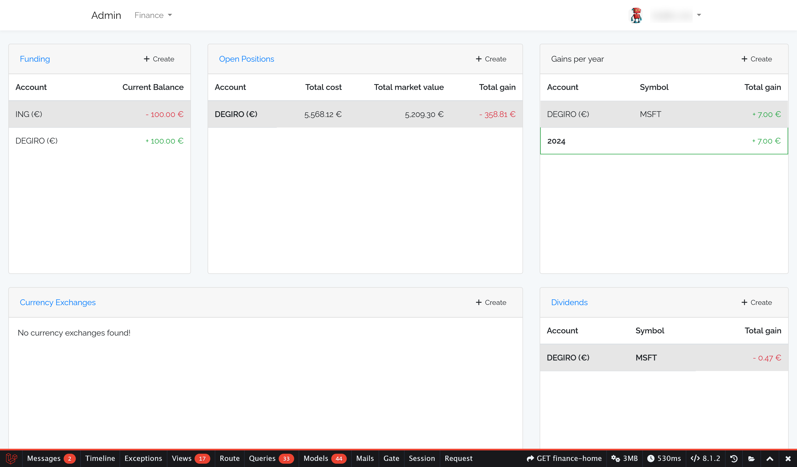
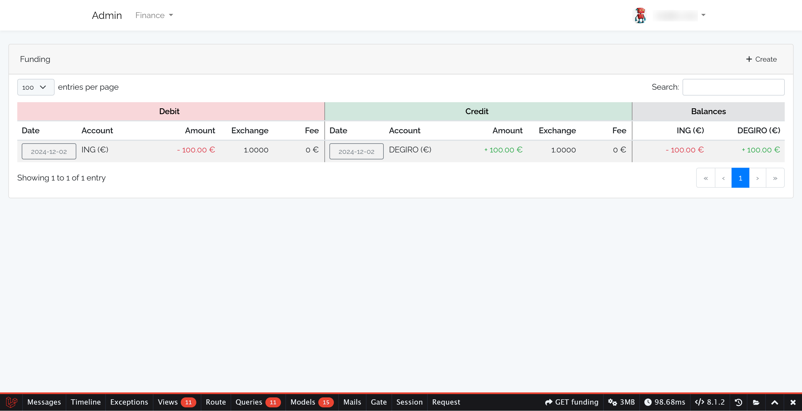
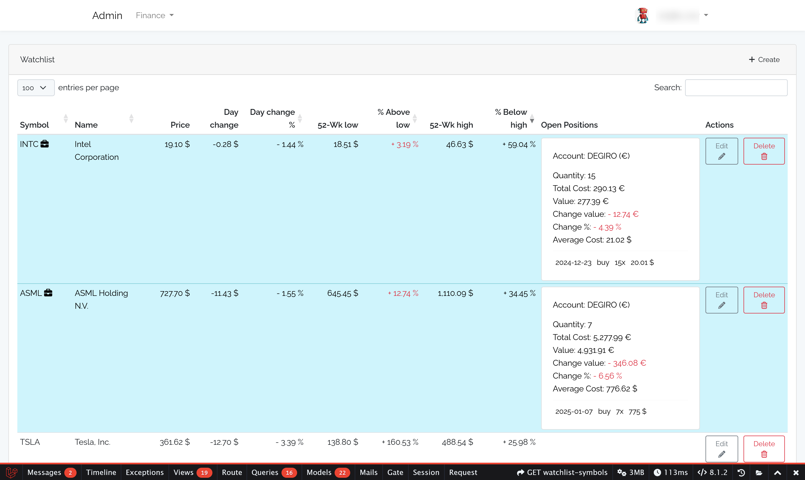
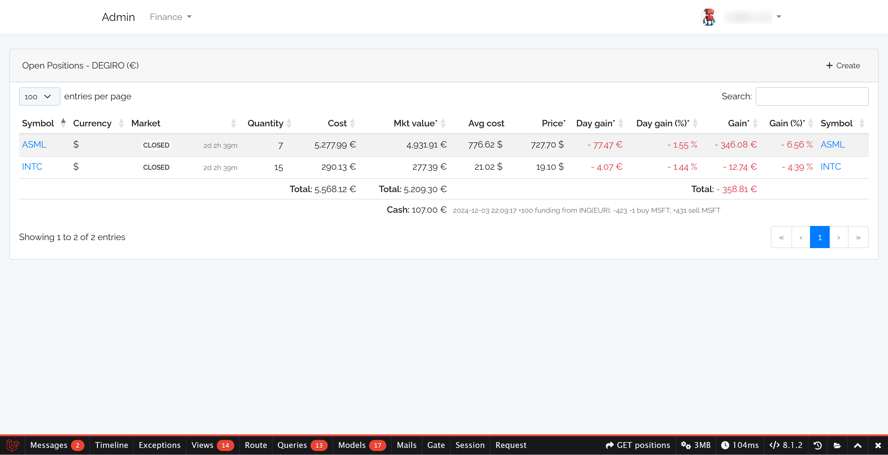
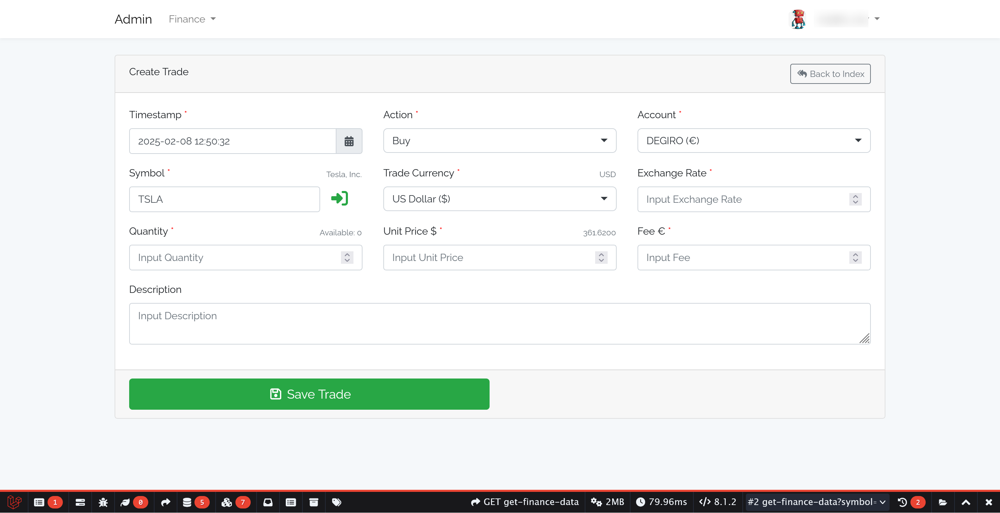

# Laravel Package MyFinance2

Laravel package for managing my finances

- account
- currency
- ledger
- funding
- watchlist
- trades
- positions
- cash
- dividends
- timeline


## Images











More images in the [images folder](images).


## Installation instructions

```bash
sudo apt-get install php-intl php-dom php-mysql php-mbstring php-gd htop colordiff

mysql -uroot -p
    CREATE DATABASE [MYFINANCE2_DB_DATABASE];
    CREATE USER '[MYFINANCE2_DB_USERNAME]'@'localhost' IDENTIFIED WITH mysql_native_password BY '[MYFINANCE2_DB_PASSWORD]';
    GRANT ALL PRIVILEGES ON [MYFINANCE2_DB_DATABASE].* TO '[MYFINANCE2_DB_USERNAME]'@'localhost';

    -- For foreign key constraints
    GRANT SELECT ON [DB_DATABASE].users TO '[MYFINANCE2_DB_USERNAME]'@'localhost';
    GRANT REFERENCES ON [DB_DATABASE].users TO '[MYFINANCE2_DB_USERNAME]'@'localhost';
    FLUSH PRIVILEGES;

    exit

mysql -u[MYFINANCE2_DB_USERNAME] -p [MYFINANCE2_DB_DATABASE] # use [MYFINANCE2_DB_PASSWORD] set above


#NOTE Execute the following if the Database Migration was not already run in the main package
php artisan migrate --pretend
php artisan migrate
# php artisan migrate:rollback # If needed
```

### Get market status (used by /positions)

```bash
sudo chmod 775 src/scripts/market_status.py
sudo chown :www-data src/scripts/market_status.py

sudo apt-get update
sudo apt install python3-pip
# pip install pandas-market-calendars
sudo pip install pandas-market-calendars

# Test
./src/scripts/market_status.py 'LSE'
```

### Install curl-impersonate to avoid '429 Too Many Requests' responses

```bash
mkdir ~/curl-impersonate/
cd ~/curl-impersonate/
wget https://github.com/lwthiker/curl-impersonate/releases/download/v0.6.1/libcurl-impersonate-v0.6.1.x86_64-linux-gnu.tar.gz
tar -xf libcurl-impersonate-v0.6.1.x86_64-linux-gnu.tar.gz

sudo su
cd /usr/local/lib/
ln -s /home/$USER/curl-impersonate/libcurl-impersonate-chrome.so .
ls -la /usr/local/lib/libcurl-impersonate-chrome.so
```

### Prepare account overview and symbol charts

```bash
cd ~/Repositories/laravel-admin/storage/
sudo chown -R :www-data app
# sudo chmod -R 775 app/*
sudo chmod -R 775 app
```

### Get historical data

```bash
# Clear cache
sudo rm -rf storage/app/charts/*
sudo chown $USER:www-data -R storage/framework/
sudo chmod g+w -R storage/framework/
php artisan cache:clear && php artisan config:cache

# Purpose: Backfills raw historical stock prices, useful for charting or after adding new symbols
# For each symbol (stock ticker) in your portfolio:
# - Fetches historical price data (open, high, low, close) from Yahoo Finance
# - (Added) Fetches exchange rates
# - Persists raw daily price points to database via Stats::persistHistoricalData()
# Key difference:
# - --historical                  → fetches stock prices per symbol
# - --historical-account-overview → calculates account statistics per account/date
# (NOT in crontab)
sudo su - www-data -s /bin/bash -c "export LOG_CHANNEL=stdout; cd /home/$USER/Repositories/laravel-admin/ && php artisan app:finance-api-cron --historical --start=2026-01-08 --end=2026-01-18"

# Purpose: Maintains a complete week of historical account performance data for trend analysis and recovery after downtime
# For each historical date:
# - Recalculates account statistics as they were on that specific date
# - Persists: cost, market value, change, cash balance per account
# - Rebuilds historical chart data points
# NOTE This command expects data to be already in, so run the command from above
# NOTE If we use the same start & end dates for both commands, it may fail if there is no failover. To go around that, extend the first command to the left with a few days
sudo su - www-data -s /bin/bash -c "export LOG_CHANNEL=stdout; cd /home/$USER/Repositories/laravel-admin/ && php artisan app:finance-api-cron --historical-account-overview --start=$(date +%Y-%m-%d --date '-8 day') --end=$(date +%Y-%m-%d --date '-1 day')"
```


### Refresh returns data

```bash
# Purpose: Pre-caches returns data for all years (MIN_YEAR to current year)
# For each year:
# - Past years (2016-2025): Checks if cache exists (marker: 'returns_year_YYYY_complete')
#   - If cache exists and is valid (4 weeks TTL): Skips processing, logs "cache is still valid"
#   - If cache doesn't exist or expired: Executes full returns flow, auto-caches for 4 weeks
# - Current year (2026): Always clears cache and refreshes (auto-caches for 1 hour)
# Benefits:
# - Faster page loads for /returns pages (data pre-cached)
# - Reduced API calls to Yahoo Finance
# - Maintains fresh data for current year
# (NOT in crontab - runs ad-hoc when needed or scheduled separately)
sudo su - www-data -s /bin/bash -c "export LOG_CHANNEL=stdout; cd /home/$USER/Repositories/laravel-admin/ && php artisan app:finance-api-cron --refresh-returns"

# With --force flag: Clears all cache markers and refreshes ALL years (including those with valid cache)
# Use this when you need to rebuild the entire cache (e.g., after config changes, price overrides, etc.)
sudo su - www-data -s /bin/bash -c "export LOG_CHANNEL=stdout; cd /home/$USER/Repositories/laravel-admin/ && php artisan app:finance-api-cron --refresh-returns --force"
```


### Enable finance-api-cron for better performance & maintaining a complete week of historical account data

```bash
cd ~/Repositories/laravel-admin/
>storage/logs/finance-api-cron.log
chown :www-data storage/logs/finance-api-cron.log
ls -la storage/logs/finance-api-cron.log
tail -f storage/logs/finance-api-cron.log

sudo apt install cpulimit

sudo su
crontab -e

#############
# Purpose: Keeps your portfolio data fresh with live market prices
# - refreshQuotes(): Fetches current market prices for all symbols (stocks) in your trades, dividends, and watchlist
# - refreshExchangeRates(): Fetches current exchange rates for all currency pairs used in multi-currency trades
# - refreshAccountOverview(): Calculates and persists current account statistics (total cost, market value, change, cash balance) and builds real-time charts

* * * * * ( sleep 5; su - www-data -s /bin/bash -c "export LOG_CHANNEL=stdout; export LD_PRELOAD=/usr/local/lib/libcurl-impersonate-chrome.so; export CURL_IMPERSONATE=chrome116; cd [USER_HOME]/Repositories/laravel-admin/ && cpulimit -l 50 -- php artisan app:finance-api-cron >> [USER_HOME]/Repositories/laravel-admin/storage/logs/finance-api-cron.log 2>&1" )

# Uncomment the next line if you want to have twice-per-minute updates
#* * * * * ( sleep 35; su - www-data -s /bin/bash -c "export LOG_CHANNEL=stdout; export LD_PRELOAD=/usr/local/lib/libcurl-impersonate-chrome.so; export CURL_IMPERSONATE=chrome116; cd [USER_HOME]/Repositories/laravel-admin/ && cpulimit -l 50 -- php artisan app:finance-api-cron >> [USER_HOME]/Repositories/laravel-admin/storage/logs/finance-api-cron.log 2>&1" )
#############

#############
# Purpose: Maintains a complete week of historical account performance data for trend analysis and recovery after downtime
# For each historical date:
# - Recalculates account statistics as they were on that specific date
# - Persists: cost, market value, change, cash balance per account
# - Rebuilds historical chart data points

# Run the job every day at 06:01 => get the past week
HISTORICAL_START=$(date +%Y-%m-%d --date '-8 day')
HISTORICAL_END=$(date +%Y-%m-%d --date '-1 day')

01 06 * * * su - www-data -s /bin/bash -c "export LOG_CHANNEL=stdout; export LD_PRELOAD=/usr/local/lib/libcurl-impersonate-chrome.so; export CURL_IMPERSONATE=chrome116; cd [USER_HOME]/Repositories/laravel-admin/ && cpulimit -l 50 -- php artisan app:finance-api-cron --historical-account-overview --start=${HISTORICAL_START} --end=${HISTORICAL_END} >> [USER_HOME]/Repositories/laravel-admin/storage/logs/finance-api-cron.log 2>&1"

# Run the job 150s after reboot
@reboot sleep 150 && su - www-data -s /bin/bash -c "export LOG_CHANNEL=stdout; export LD_PRELOAD=/usr/local/lib/libcurl-impersonate-chrome.so; export CURL_IMPERSONATE=chrome116; cd [USER_HOME]/Repositories/laravel-admin/ && cpulimit -l 50 -- php artisan app:finance-api-cron --historical-account-overview --start=${HISTORICAL_START} --end=${HISTORICAL_END} >> [USER_HOME]/Repositories/laravel-admin/storage/logs/finance-api-cron.log 2>&1"
#############

#############
# Purpose: Pre-caches returns data for all years to ensure fast page loads
# - Past years (2016-2025): Only refreshes if cache expired (4 weeks TTL), otherwise skips
# - Current year (2026): Always refreshes (1 hour TTL)
# Benefits:
# - Users get instant page loads when viewing /returns
# - Minimizes Yahoo Finance API calls by leveraging long-term cache for historical data
# - Ensures current year data stays fresh with hourly updates

# Run the job every hour at minute 24
24 * * * * su - www-data -s /bin/bash -c "export LOG_CHANNEL=stdout; export LD_PRELOAD=/usr/local/lib/libcurl-impersonate-chrome.so; export CURL_IMPERSONATE=chrome116; cd [USER_HOME]/Repositories/laravel-admin/ && cpulimit -l 50 -- php artisan app:finance-api-cron --refresh-returns >> [USER_HOME]/Repositories/laravel-admin/storage/logs/finance-api-cron.log 2>&1"

# Run the job 250s after reboot
@reboot sleep 250 && su - www-data -s /bin/bash -c "export LOG_CHANNEL=stdout; export LD_PRELOAD=/usr/local/lib/libcurl-impersonate-chrome.so; export CURL_IMPERSONATE=chrome116; cd [USER_HOME]/Repositories/laravel-admin/ && cpulimit -l 50 -- php artisan app:finance-api-cron --refresh-returns >> [USER_HOME]/Repositories/laravel-admin/storage/logs/finance-api-cron.log 2>&1"
#############

#############
# Purpose: Pre-caches watchlist symbol performance tags (gains, windows, metrics) for all users
# - Clears and rebuilds the 2-hour performance cache for every user
# - Ensures /watchlist-symbols page loads instantly without on-the-fly gain computation
# - Cache TTL: 2 hours; cron re-warms it hourly

# Run the job every hour at minute 54 (staggered from --refresh-returns at :24)
54 * * * * su - www-data -s /bin/bash -c "export LOG_CHANNEL=stdout; export LD_PRELOAD=/usr/local/lib/libcurl-impersonate-chrome.so; export CURL_IMPERSONATE=chrome116; cd [USER_HOME]/Repositories/laravel-admin/ && cpulimit -l 50 -- php artisan app:finance-api-cron --refresh-symbol-performance >> [USER_HOME]/Repositories/laravel-admin/storage/logs/finance-api-cron.log 2>&1"

# Run the job 400s after reboot (after stats-cron at 350s)
@reboot sleep 400 && su - www-data -s /bin/bash -c "export LOG_CHANNEL=stdout; export LD_PRELOAD=/usr/local/lib/libcurl-impersonate-chrome.so; export CURL_IMPERSONATE=chrome116; cd [USER_HOME]/Repositories/laravel-admin/ && cpulimit -l 50 -- php artisan app:finance-api-cron --refresh-symbol-performance >> [USER_HOME]/Repositories/laravel-admin/storage/logs/finance-api-cron.log 2>&1"
#############
```


### Setup stats-cron for cleanup

```bash
cd ~/Repositories/laravel-admin/
>storage/logs/stats-cron.log
chown :www-data storage/logs/stats-cron.log
ls -la storage/logs/stats-cron.log
tail -f storage/logs/stats-cron.log

sudo su
crontab -e

#############
# Prevents accumulation of stale real-time statistics, maintains clean database
# - cleanupStatsToday(): Deletes old rows from stats_today table (rows in stats_today with data from yesterday or before)

# Run the job every hour at minute 42
42 * * * * su - www-data -s /bin/bash -c "export LOG_CHANNEL=stdout; cd [USER_HOME]/Repositories/laravel-admin/ && cpulimit -l 50 -- php artisan app:stats-cron >> [USER_HOME]/Repositories/laravel-admin/storage/logs/stats-cron.log 2>&1"

# Run the job 350s after reboot
@reboot sleep 350 && su - www-data -s /bin/bash -c "export LOG_CHANNEL=stdout; cd [USER_HOME]/Repositories/laravel-admin/ && cpulimit -l 50 -- php artisan app:stats-cron >> [USER_HOME]/Repositories/laravel-admin/storage/logs/stats-cron.log 2>&1"
#############
```


### finance:peak-proximity-alerts

Emails an exit-hint alert when an open position has rallied close to its peak in the 3M / 6M / 1Y / 2Y windows. Each window has its own proximity threshold, tighter for near-term peaks and looser for long-term ones: within 2% of the 3M peak, 5% of the 6M peak, 8% of the 1Y peak, or 10% of the 2Y peak.

**The alert is exit-focused** so it stays actionable rather than noisy. "Near peak" is an exit aid, so an email only fires for a position you would actually consider trimming, that is, one whose gain-based effective tier is **weak (Rust or Bronze)**. Strong holdings (Platinum, Gold, Silver) never email; they appear in the inbox as informational only. The gain-based tier is the gate; the HOLD / EXIT action is shown for context but never gates. An email also needs a **meaningful** window near peak (6M, 1Y or 2Y): a 3M-only signal is context and never emails on its own.

**Cadence escalates with confluence.** You get one email when an alert opens, then reminders that come faster the more long windows are near peak at once (one window: weekly; two: every 3 days; three: daily). A new long window crossing into near-peak emails right away. There is no reminder cap; reminders continue until you dismiss the alert (and a per-day throttle still caps it at one email per symbol per day, so running the cron hourly is safe).

The email reproduces the data shown in the three watchlist-symbols cards for that symbol (performance, quadrant, open positions) plus a summary of the current price, distance from the peak, and the gain if sold now. The subject leads with the tier and names the closest window, e.g. `[MyFinance2] EZJ.L (Bronze, EXIT) near peak => -4.25% to 6M`; reminders are prefixed `Reminder:`. If a symbol already alerted today and you want it to fire again the same day, re-arm it from the per-symbol page at `/peak-proximity-alerts` (the Re-arm button clears today's record).

**Front-end inbox.** Every near-peak position (actionable and informational) becomes a card in the inbox at `/peak-proximity-alerts/inbox`, sorted by severity. Cards persist until you dismiss them, even after the symbol is no longer near peak, so nothing is silently lost. Dismissing one ends its email reminders; if the symbol later returns to peak, a fresh alert opens. The full rule set is also documented on the `/peak-proximity-alerts` page itself.

```bash
sudo su
crontab -e

#############
# Purpose: Hourly exit-hint email when an open position is near its 3M/6M/1Y/2Y peak.
# Throttled to one email per symbol per day, so running it every hour is safe.
# Runs at minute :12, clear of the other finance crons (--refresh-returns at :24,
# app:stats-cron at :42, --refresh-symbol-performance at :54), so no two ever run the
# same minute. It reads live quotes through the watchlist dashboard, so it uses the
# same curl-impersonate env and cpulimit as the other finance-api-cron jobs, and logs
# to finance-api-cron.log (its WARNING+ entries then surface in the logs:email-daily-errors digest).

12 * * * * su - www-data -s /bin/bash -c "export LOG_CHANNEL=stdout; export LD_PRELOAD=/usr/local/lib/libcurl-impersonate-chrome.so; export CURL_IMPERSONATE=chrome116; cd [USER_HOME]/Repositories/laravel-admin/ && cpulimit -l 50 -- php artisan finance:peak-proximity-alerts --all-users >> [USER_HOME]/Repositories/laravel-admin/storage/logs/finance-api-cron.log 2>&1"

# Run the job 480s after reboot (staggered after the other finance reboot jobs, the last of which is at 400s)
@reboot sleep 480 && su - www-data -s /bin/bash -c "export LOG_CHANNEL=stdout; export LD_PRELOAD=/usr/local/lib/libcurl-impersonate-chrome.so; export CURL_IMPERSONATE=chrome116; cd [USER_HOME]/Repositories/laravel-admin/ && cpulimit -l 50 -- php artisan finance:peak-proximity-alerts --all-users >> [USER_HOME]/Repositories/laravel-admin/storage/logs/finance-api-cron.log 2>&1"
#############
```

To limit hourly runs to market hours (08:00 to 22:00 server time), use `12 8-22 * * *` instead of `12 * * * *`.

```bash
# Preview for one user without sending or recording
php artisan finance:peak-proximity-alerts --user-id=1 --dry-run

# All users with open positions
php artisan finance:peak-proximity-alerts --all-users

# Override every window with one uniform threshold, or narrow to specific symbols
php artisan finance:peak-proximity-alerts --user-id=1 --threshold=10
php artisan finance:peak-proximity-alerts --user-id=1 --symbols=AMD,ETH-EUR
```

`--threshold=N` replaces all four per-window thresholds with a single uniform value of N%.

These alerts are **off by default**. Each user enables the symbols they want at `/peak-proximity-alerts` (enable/disable per symbol or in bulk; an optional "until" date makes the change temporary and auto-reverts afterwards; Active/All filter). The hourly cron runs `--all-users`; only users who enabled at least one symbol receive emails, so a full run is a no-op for everyone else.

Configuration (env, all optional): `MYFINANCE2_PEAK_PROXIMITY_ENABLED` (default true); the per-window thresholds `MYFINANCE2_PEAK_PROXIMITY_THRESHOLD_3M` / `_6M` / `_1Y` / `_2Y` (defaults 2 / 5 / 8 / 10); `MYFINANCE2_PEAK_PROXIMITY_THRESHOLD_PCT` (default 5, the fallback when a window has no specific threshold); `MYFINANCE2_PEAK_PROXIMITY_EMAIL_TO` (defaults to the alerts email, then the user's email). Migrations add the `peak_proximity_notifications` audit table and the `peak_proximity_alert_settings` opt-in table; run `php artisan migrate` to apply them.


### finance:dip-buying-alerts

The inverse of peak-proximity: a deploy-cash hint on the way **down**. The Dip Buying Plan paces how you spend a dip-buying cash pool as the market falls, from a fixed EUR pool, a front-loaded drawdown "ladder", a gap-to-target verdict, a VUSA-vs-200-day-MA trend rail (context only, never a "wait"), and a six-month stall backstop that releases idle cash on a slow schedule. It is behavioral damage-control for cash you keep anyway; it does **not** promise to beat staying invested. One engine (`DipBuyingPlanService`) feeds four surfaces: a panel on `/positions`, this opt-in email (checked hourly, capped at one per day), the settings page `/dip-buying-alerts`, and the self-validation backtest at `/dip-buying-backtest`.

The drawdown axis is `effective_dd = max(VUSA.AS trailing-peak drawdown, your portfolio drawdown)`; the reserve ladder is cumulative % of the pool to have deployed at each depth (default: 10%->30%, 15%->55%, 20%->75%, 25%->90%, 30%->100%). The verdict is "no dip yet" below 10%, then behind / on plan / ahead of plan against the band target (5pp tolerance). The email fires only on a state change (the band deepens, you cross from on-plan to behind, or the stall backstop activates), throttled to one per day; there is deliberately no "the trend turned" email.

```bash
sudo su
crontab -e

#############
# Purpose: Dip Buying Plan email when the plan's state changes (the band deepens, you cross from
# on-plan to behind, or the stall backstop activates). Checked hourly but throttled to one email per
# user per day, so running every hour is safe; it just surfaces a state change sooner instead of
# waiting for the close. Off by default; only users who enabled the feature AND the email channel on
# /dip-buying-alerts are processed, so a full run is a no-op for everyone else. The command is
# lightweight (reads the cached drawdown plan, no Yahoo API), runs at minute :33, clear of the other
# finance crons (peak-proximity at :12, --refresh-returns at :24, app:stats-cron at :42,
# --refresh-symbol-performance at :54), and logs to finance-api-cron.log (WARNING+ entries surface in
# the logs:email-daily-errors digest).

33 * * * * su - www-data -s /bin/bash -c "export LOG_CHANNEL=stdout; cd [USER_HOME]/Repositories/laravel-admin/ && cpulimit -l 50 -- php artisan finance:dip-buying-alerts --all-users >> [USER_HOME]/Repositories/laravel-admin/storage/logs/finance-api-cron.log 2>&1"

# Run shortly after boot too (after peak-proximity at 480s), once the caches are warm
@reboot sleep 510 && su - www-data -s /bin/bash -c "export LOG_CHANNEL=stdout; cd [USER_HOME]/Repositories/laravel-admin/ && cpulimit -l 50 -- php artisan finance:dip-buying-alerts --all-users >> [USER_HOME]/Repositories/laravel-admin/storage/logs/finance-api-cron.log 2>&1"
#############
```

To limit hourly runs to market hours (08:00 to 22:00 server time), use `33 8-22 * * *` instead of `33 * * * *`.

```bash
# Preview for one user without sending or recording
php artisan finance:dip-buying-alerts --user-id=1 --dry-run

# All users with the feature + email enabled
php artisan finance:dip-buying-alerts --all-users

# Self-validation backtest: replay your trades through the ladder (CLI mirror of /dip-buying-backtest)
php artisan finance:dip-buying-backtest --user-id=1
php artisan finance:dip-buying-backtest --user-id=1 --from=2025-01-01 --pool=10000
```

These alerts are **off by default**. Set the pool, enable the feature and the email channel at `/dip-buying-alerts` (an optional advanced JSON override replaces the default ladder). Configuration (env, all optional): `MYFINANCE2_DIP_BUYING_ENABLED` (default true); `MYFINANCE2_DIP_BUYING_TOLERANCE_PCT` (default 5); `MYFINANCE2_DIP_BUYING_PEAK_LOOKBACK_YEARS` (default 3); `MYFINANCE2_DIP_BUYING_MA_TREND_PERIOD` (default 200); `MYFINANCE2_DIP_BUYING_STALL_BACKSTOP_MONTHS` (default 6); `MYFINANCE2_DIP_BUYING_MIN_EPISODE_DD_PCT` (default 10); `MYFINANCE2_DIP_BUYING_RSI_NOTE_ENABLED` (default false) with `MYFINANCE2_DIP_BUYING_RSI_OVERSOLD_LEVEL` (default 30); `MYFINANCE2_DIP_BUYING_EMAIL_TO` (defaults to the alerts email, then the user's email). Migrations add the `dip_buying_settings` opt-in table and the `dip_buying_notifications` audit/throttle table; run `php artisan migrate` to apply them. The per-user plan is cached 2h (like `DrawdownService`); a settings change clears it, and editing the ladder defaults or the drawdown formula needs a `cache:clear`.


### finance:portfolio-peak-alerts

The mirror image of the dip-buying alert, at the **portfolio** level and on the way **up**. It emails when your whole portfolio's EUR gain (`change_EUR`) or return on cost (`changePercentage_EUR`) has rallied back to within N% of its rolling 6M / 1Y / 2Y high, a "consider reducing exposure, taking some profit, or rebalancing" hint that complements the per-symbol `finance:peak-proximity-alerts`. Both series are read from the stored daily overview chart through the shared `ChartsBuilder::getChartOverviewUserAsArray()` accessor; the VUSA.AS 2Y distance is included in the email for context only and never gates the trigger.

Each metric can be enabled or disabled independently per user. **Negative window peaks are in scope**: a book that keeps selling winners can be left holding losers and sit underwater even at its window high, so `change_EUR` proximity is measured against `|peak|` (with a `min_peak_abs_eur` magnitude floor to skip near-zero peaks that would flip on noise) and `changePercentage_EUR` proximity is measured on the value index `1 + return/100` (the same transform the Dip Buying engine uses), so the "drawdown from the window high" reading stays sane whether the peak return is +40% or -3%. The alert fires when **any** enabled (metric, window) pair is within its **per-metric** window threshold (Return % defaults 1 / 3 / 5% for 6M / 1Y / 2Y; EUR gain defaults 10 / 20 / 30%, wider because its proximity is measured against `|peak|` and moves with contributions), capped at one email per user per day, then re-sent every `reminder_days` (default 7) while the condition holds.

The email renders a **full per-window breakdown table** (metric x window), not just the windows that fired: for each metric it shows the current value, the window peak and its date, how far below the peak the value sits, the window's threshold, and whether that window fires. This is a calibration aid, so you can see how close each window is and whether a threshold needs tuning. A **3M window** is included in the table for context only (it is shown for awareness and never fires on its own, mirroring the per-symbol peak-proximity alert's treatment of 3M).

```bash
sudo su
crontab -e

#############
# Purpose: Portfolio Peak Alert email when the portfolio's EUR gain or return on cost is near its
# rolling 6M/1Y/2Y high. Checked hourly but throttled to one email per user per day, so running
# every hour is safe; it just surfaces a trigger sooner. Off by default; only users who enabled the
# feature AND the email channel on /portfolio-peak-alerts are processed, so a full run is a no-op
# for everyone else. The command is lightweight (reads the cached overview chart series, no Yahoo
# API), runs at minute :48, clear of the other finance crons (peak-proximity at :12,
# --refresh-returns at :24, dip-buying at :33, app:stats-cron at :42, --refresh-symbol-performance
# at :54), and logs to finance-api-cron.log (WARNING+ entries surface in the
# logs:email-daily-errors digest).

48 * * * * su - www-data -s /bin/bash -c "export LOG_CHANNEL=stdout; cd [USER_HOME]/Repositories/laravel-admin/ && cpulimit -l 50 -- php artisan finance:portfolio-peak-alerts --all-users >> [USER_HOME]/Repositories/laravel-admin/storage/logs/finance-api-cron.log 2>&1"

# Run shortly after boot too (after dip-buying at 510s), once the caches are warm
@reboot sleep 540 && su - www-data -s /bin/bash -c "export LOG_CHANNEL=stdout; cd [USER_HOME]/Repositories/laravel-admin/ && cpulimit -l 50 -- php artisan finance:portfolio-peak-alerts --all-users >> [USER_HOME]/Repositories/laravel-admin/storage/logs/finance-api-cron.log 2>&1"
#############
```

To limit hourly runs to market hours (08:00 to 22:00 server time), use `48 8-22 * * *` instead of `48 * * * *`.

```bash
# Preview for one user without sending or recording
php artisan finance:portfolio-peak-alerts --user-id=1 --dry-run

# All users with the feature + email enabled
php artisan finance:portfolio-peak-alerts --all-users
```

These alerts are **off by default**. Enable the feature, the email channel and the per-metric toggles at `/portfolio-peak-alerts`. That page also renders the same per-window breakdown table live as a "Current standing" card (the same `PortfolioPeakAlertService` computation the email uses), so you can see where each window sits against its threshold without waiting for an email. Configuration (env, all optional): `MYFINANCE2_PORTFOLIO_PEAK_ENABLED` (default true); per-metric window thresholds `MYFINANCE2_PORTFOLIO_PEAK_EUR_THRESHOLD_3M` / `_6M` / `_1Y` / `_2Y` (defaults 5 / 10 / 20 / 30) and `MYFINANCE2_PORTFOLIO_PEAK_PCT_THRESHOLD_3M` / `_6M` / `_1Y` / `_2Y` (defaults 0.5 / 1 / 3 / 5); the 3M values are a reference line for the context row only, since 3M never fires; `MYFINANCE2_PORTFOLIO_PEAK_MIN_PEAK_ABS_EUR` (default 1000); `MYFINANCE2_PORTFOLIO_PEAK_REMINDER_DAYS` (default 7, `0` means every run that finds a trigger, still capped at one email per day); `MYFINANCE2_PORTFOLIO_PEAK_EMAIL_TO` (defaults to the alerts email, then the user's email). Migrations add the `portfolio_peak_settings` opt-in table and the `portfolio_peak_notifications` audit/throttle table; run `php artisan migrate` to apply them.


### Running tests

NOTE That there are 2 types of tests, in 2 locations:
- Unit tests (in this package project)
- Feature tests (in the root project, because these need the context of the full laravel application)

```bash
# Running unit tests (in this package project)
# php vendor/bin/phpunit --filter ChartsBuilderMetrics --testdox --debug
php vendor/bin/phpunit --testdox
```


### Others

```bash
#NOTE If there were database entries that didn't have user_id before, execute the following

mysql -u[MYFINANCE2_DB_USERNAME] -p [MYFINANCE2_DB_DATABASE] # use [MYFINANCE2_DB_PASSWORD] set above
    select * from `[DB_DATABASE]`.`users`;

    update `cash_balances` set user_id = [USER_ID] where user_id is null;
    update `dividends` set user_id = [USER_ID] where user_id is null;
    update `ledger_transactions` set user_id = [USER_ID] where user_id is null;
    update `trades` set user_id = [USER_ID] where user_id is null;
    update `watchlist_symbols` set user_id = [USER_ID] where user_id is null;

    -- Optional (add currency exchanges to avoid warnings)
    insert into stats_historical (date, symbol, unit_price, currency_iso_code) values ('2025-01-01', 'EURGBP=X', '0.8268', 'GBP');
    insert into stats_historical (date, symbol, unit_price, currency_iso_code) values ('2025-01-01', 'EURUSD=X', '1.0352', 'USD');
    insert into stats_historical (date, symbol, unit_price, currency_iso_code) values ('2024-12-31', 'EURGBP=X', '0.8268', 'GBP');
    insert into stats_historical (date, symbol, unit_price, currency_iso_code) values ('2024-12-31', 'EURUSD=X', '1.0352', 'USD');
    insert into stats_historical (date, symbol, unit_price, currency_iso_code) values ('2024-12-30', 'EURGBP=X', '0.8268', 'GBP');
    insert into stats_historical (date, symbol, unit_price, currency_iso_code) values ('2024-12-30', 'EURUSD=X', '1.0352', 'USD');
    select * from stats_historical where date = '2025-01-01' and symbol like '%=X';
```

