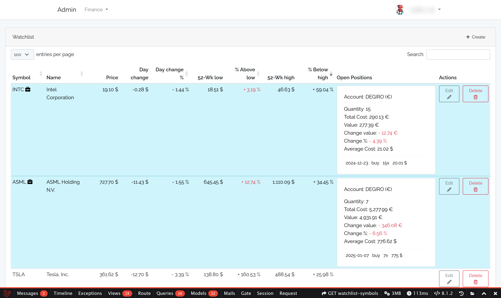

# Laravel Package MyFinance2

Laravel package for managing my finances

- account
- currency
- ledger
- funding
- watchlist
- trades
- positions
- cash
- dividends
- timeline


## Images





More images in the [images folder](images).


## Installation instructions

```bash
sudo apt-get install php-intl php-dom php-mysql php-mbstring php-gd htop colordiff

mysql -uroot -p
    CREATE DATABASE [MYFINANCE2_DB_DATABASE];
    CREATE USER '[MYFINANCE2_DB_USERNAME]'@'localhost' IDENTIFIED WITH mysql_native_password BY '[MYFINANCE2_DB_PASSWORD]';
    GRANT ALL PRIVILEGES ON [MYFINANCE2_DB_DATABASE].* TO '[MYFINANCE2_DB_USERNAME]'@'localhost';

    -- For foreign key constraints
    GRANT SELECT ON [DB_DATABASE].users TO '[DB_USERNAME]'@'localhost';
    GRANT REFERENCES ON [DB_DATABASE].users TO '[DB_USERNAME]'@'localhost';
    FLUSH PRIVILEGES;

    exit

mysql -u[MYFINANCE2_DB_USERNAME] -p [MYFINANCE2_DB_DATABASE] # use [MYFINANCE2_DB_PASSWORD] set above


#NOTE Execute the following if the Database Migration was not already run in the main package
php artisan migrate --pretend
php artisan migrate
# php artisan migrate:rollback # If needed

#NOTE If there were database entries that didn't have user_id before, execute the following

mysql -u[MYFINANCE2_DB_USERNAME] -p [MYFINANCE2_DB_DATABASE] # use [MYFINANCE2_DB_PASSWORD] set above
    select * from `[DB_DATABASE]`.`users`;

    update `cash_balances` set user_id = [USER_ID] where user_id is null;
    update `dividends` set user_id = [USER_ID] where user_id is null;
    update `ledger_transactions` set user_id = [USER_ID] where user_id is null;
    update `trades` set user_id = [USER_ID] where user_id is null;
    update `watchlist_symbols` set user_id = [USER_ID] where user_id is null;

    -- Optional (add currency exchanges to avoid warnings)
    insert into stats_historical (date, symbol, unit_price, currency_iso_code) values ('2025-01-01', 'EURGBP=X', '0.8268', 'GBP');
    insert into stats_historical (date, symbol, unit_price, currency_iso_code) values ('2025-01-01', 'EURUSD=X', '1.0352', 'USD');
    insert into stats_historical (date, symbol, unit_price, currency_iso_code) values ('2024-12-31', 'EURGBP=X', '0.8268', 'GBP');
    insert into stats_historical (date, symbol, unit_price, currency_iso_code) values ('2024-12-31', 'EURUSD=X', '1.0352', 'USD');
    insert into stats_historical (date, symbol, unit_price, currency_iso_code) values ('2024-12-30', 'EURGBP=X', '0.8268', 'GBP');
    insert into stats_historical (date, symbol, unit_price, currency_iso_code) values ('2024-12-30', 'EURUSD=X', '1.0352', 'USD');
    select * from stats_historical where date = '2025-01-01' and symbol like '%=X';
```

### Get market status (used by /positions)

```bash
sudo chmod 775 src/scripts/market_status.py
sudo chown :www-data src/scripts/market_status.py

sudo apt-get update
sudo apt install python3-pip
# pip install pandas-market-calendars
sudo pip install pandas-market-calendars

# Test
./src/scripts/market_status.py 'LSE'
```

### Install curl-impersonate to avoid '429 Too Many Requests' responses

```bash
mkdir ~/curl-impersonate/
cd ~/curl-impersonate/
wget https://github.com/lwthiker/curl-impersonate/releases/download/v0.6.1/libcurl-impersonate-v0.6.1.x86_64-linux-gnu.tar.gz
tar -xf libcurl-impersonate-v0.6.1.x86_64-linux-gnu.tar.gz

sudo su
cd /usr/local/lib/
ln -s [USER_HOME]/curl-impersonate/libcurl-impersonate-chrome.so .
ls -la /usr/local/lib/libcurl-impersonate-chrome.so
```


### Enable finance-api-cron for better performance

```bash
cd ~/Repositories/laravel-admin/
>storage/logs/finance-api-cron.log
chown :www-data storage/logs/finance-api-cron.log
ls -la storage/logs/finance-api-cron.log
tail -f storage/logs/finance-api-cron.log

sudo su
crontab -e

#############
# We need two jobs to run every 30 seconds
* * * * * su - www-data -s /bin/bash -c "export LOG_CHANNEL=stdout; export LD_PRELOAD=/usr/local/lib/libcurl-impersonate-chrome.so; export CURL_IMPERSONATE=chrome116; cd [USER_HOME]/Repositories/laravel-admin/ && php artisan app:finance-api-cron >> [USER_HOME]/Repositories/laravel-admin/storage/logs/finance-api-cron.log 2>&1"
* * * * * ( sleep 30; su - www-data -s /bin/bash -c "export LOG_CHANNEL=stdout; export LD_PRELOAD=/usr/local/lib/libcurl-impersonate-chrome.so; export CURL_IMPERSONATE=chrome116; cd [USER_HOME]/Repositories/laravel-admin/ && php artisan app:finance-api-cron >> [USER_HOME]/Repositories/laravel-admin/storage/logs/finance-api-cron.log 2>&1" )
#############

# Run the job every day at 06:01 => get the past week
HISTORICAL_START=$(date +%Y-%m-%d --date '-8 day')
HISTORICAL_END=$(date +%Y-%m-%d --date '-1 day')

01 06 * * * su - www-data -s /bin/bash -c "export LOG_CHANNEL=stdout; export LD_PRELOAD=/usr/local/lib/libcurl-impersonate-chrome.so; export CURL_IMPERSONATE=chrome116; cd [USER_HOME]/Repositories/laravel-admin/ && php artisan app:finance-api-cron --historical-account-overview --start=${HISTORICAL_START} --end=${HISTORICAL_END} >> [USER_HOME]/Repositories/laravel-admin/storage/logs/finance-api-cron.log 2>&1"
```


### Setup stats-cron

```bash
cd ~/Repositories/laravel-admin/
>storage/logs/stats-cron.log
chown :www-data storage/logs/stats-cron.log
ls -la storage/logs/stats-cron.log
tail -f storage/logs/stats-cron.log

sudo su
crontab -e

#############
# Run the job every hour at minute 24
24 * * * * su - www-data -s /bin/bash -c "export LOG_CHANNEL=stdout; cd [USER_HOME]/Repositories/laravel-admin/ && php artisan app:stats-cron >> [USER_HOME]/Repositories/laravel-admin/storage/logs/stats-cron.log 2>&1"
#############
```


### Get historical data

```bash
sudo su - www-data -s /bin/bash -c "export LOG_CHANNEL=stdout; cd [USER_HOME]/Repositories/laravel-admin/ && php artisan app:finance-api-cron --historical --start=2025-01-01 --end=2025-05-15"

sudo su - www-data -s /bin/bash -c "export LOG_CHANNEL=stdout; cd [USER_HOME]/Repositories/laravel-admin/ && php artisan app:finance-api-cron --historical-account-overview --start=$(date +%Y-%m-%d --date '-8 day') --end=$(date +%Y-%m-%d --date '-1 day')"
```

### Prepare account overview and symbol charts

```bash
cd ~/Repositories/laravel-admin/storage/
sudo chown -R ovidiuro:www-data app
sudo chmod -R 775 app/*
sudo chmod -R 775 app
```

